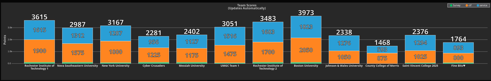

# NCAE Cyber Games

My random stuff for NCAE Cyber Games 2025, a CTF + Cybersecurity competition I joined with Boston University to compete against other universities. Info on NCAE Cyber Games [here](https://www.ncaecybergames.org/).

## Resources

## Blue Team

- [NCAE Network Topology](./NCAE-Regionals/NCAE-Info-Pics/NCAE_Network_Topology.png)
- [NCAE Tutorials](https://www.youtube.com/playlist?list=PLqux0fXsj7x3WYm6ZWuJnGC1rXQZ1018M)
- [Our team's scripts](https://github.com/kylevandoremalen/BU-NCAE)
- [Our team leader's notes](https://github.com/abelreqma/ncae_notes)

## CTF

- [PicoCTF](https://www.picoctf.org/)
- [CTF Tools](https://github.com/zardus/ctf-tools)
- [CTF 101](https://ctf101.org)

### CTF Questions I Answered

Given CTF challenges all placed in [here](./NCAE-Regionals/CTF-Questions-Screenshot/), with some of my solutions/approaches [here](./NCAE-Regionals/README.md).

## Competition Results

### Regionals

Our team was in the east-overflow region, where we competed against 11 teams from other universities. We finished first with the highest CTF and blue team score.

