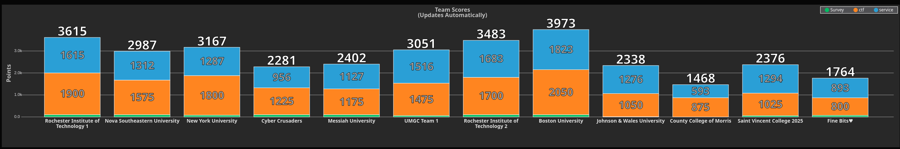

# NCAE Cyber Games

My resources for NCAE Cyber Games 2025, a CTF + Cybersecurity competition I joined with Boston University to compete against other universities. Info on NCAE Cyber Games [here](https://www.ncaecybergames.org/).

## Resources

### CTF Questions I Answered

Given CTF challenges all placed in [here](./NCAE-Regionals/CTF-Questions-Screenshot/), with some of my solutions/approaches [here](./NCAE-Regionals/README.md).

## Competition Results

### Regionals

Our team was in the east-overflow region, where we competed against 11 teams from other universities. We finished first with the highest CTF and blue team score.

